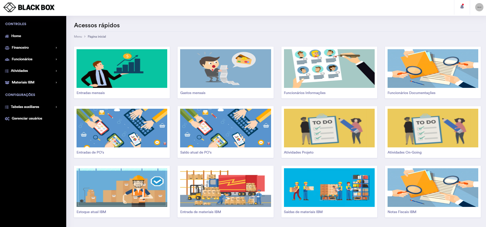

# Black Box Network Services
Esse sistema foi desenvolvido exclusivamente e personalizadamente para essa empresa, com a finalidade principal de trazer um gerenciamento de atividades da empresa, sendo elas (projeto ou on-going), mas também com intuito de ser um sistema ERP, contendo gerenciamento de colaboradores, finanças e estoque de materiais.

# Tela inicial

### Funcionalidades 

- Fluxo de caixa          
- Gerenciamento de colaboradores + documentações
- Gerenciamento e histórico de atividades da empresa
- Cadastro de novas ordens de compras
- Gerenciamento e histórico das ordens de compras
- Gerenciamento e histórico de estoque para materiais
- Controle de usuários e permissões   
- Relatórios e gráficos personalizados       

### Linguagens utilizadas 

- PHP   
- jQuery    (JavaScript)       
- Bootstrap (Framework) 
- MySQL     (Banco de dados)

